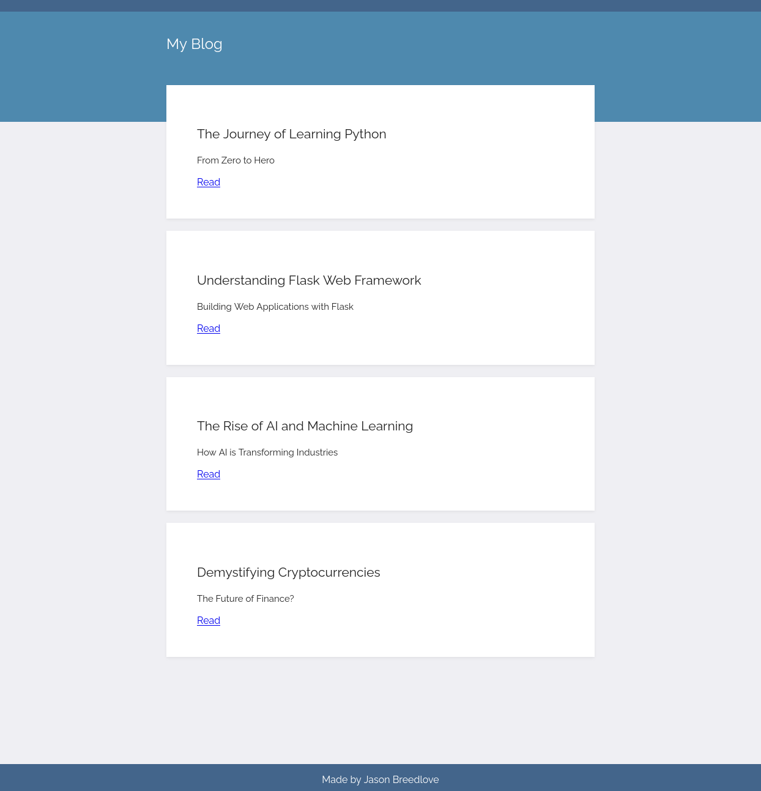

# Flask Blog API Consumer

A simple Flask application that displays blog posts using local JSON data.

## Features

- Reads posts from a local JSON file.
- Displays a list of all posts on the homepage.
- Provides a detailed view of a specific post when clicked.

## Setup & Installation

1. Ensure you have Python and Flask installed.
2. Clone the repository:
   ```
   git clone <repository-url>
   ```
3. Navigate to the project directory:
   ```
   cd path/to/directory
   ```
4. Install required packages:
   ```
   pip install -r requirements.txt
   ```
5. Run the application:
   ```
   python main.py
   ```

## Endpoints

1. **Homepage** - Displays a list of all posts.
   ```
   GET /
   ```
2. **Specific Post** - Displays details of a specific post.
   ```
   GET /post/<int:post_id>
   ```

## Future Improvements

- Integrate with a database for persistent storage.
- Add authentication and user accounts.
- Allow users to create, update, or delete posts.

